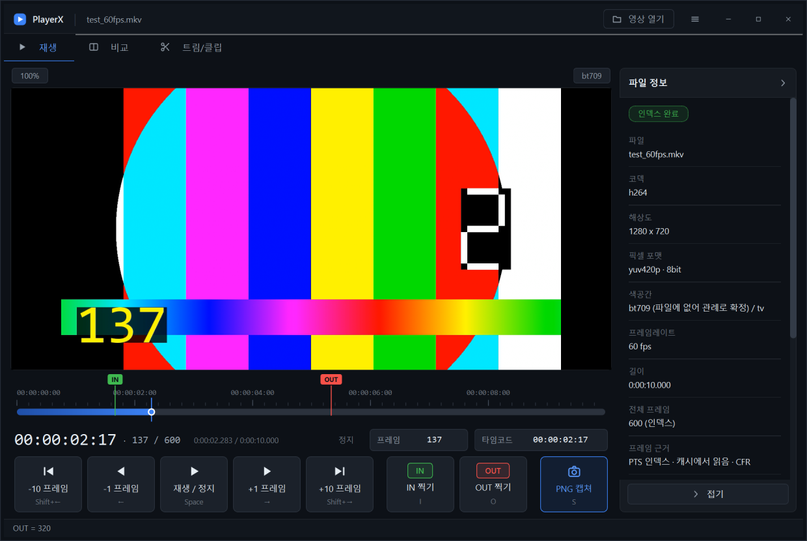
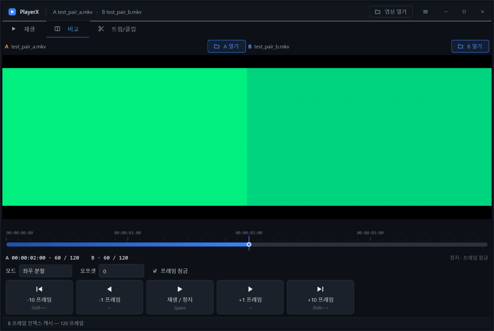
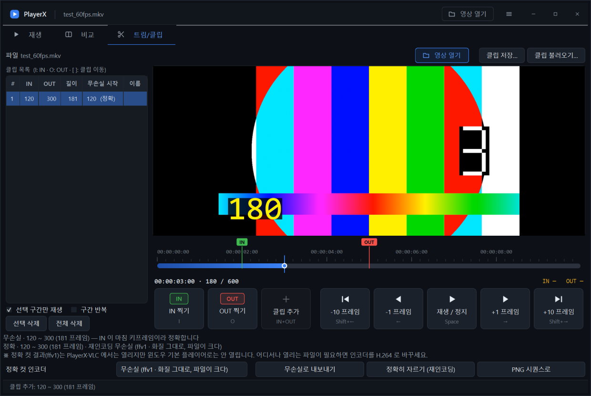

# PlayerX

프레임 단위로 정확히 멈추는 Windows 영상 검수 플레이어.

**계획한 5단계가 전부 끝났다.** 열기, 재생/정지, 프레임 이동, 프레임 번호·타임코드,
**PTS 인덱스 기반 프레임 정확도(VFR 포함)**, **무손실 PNG 캡쳐**,
**두 영상 비교(좌우 분할 · 와이프 · 차분)**, **트림과 클립(무손실 컷 · 정확 컷 ·
PNG 시퀀스)**, **설정 저장과 단독 실행 패키지**.

지금은 **6단계 — 다듬기와 보강** 중이다. 화면을 계획서의 목업대로 다시 입혔고,
쓰면서 드러난 느림·떨림을 잡고 작은 기능을 덧붙이고 있다
(구간 반복 재생, 타임코드 직접 입력, 재생 탭 IN/OUT).



전체 계획은 [docs/BUILD-PLAN.md](docs/BUILD-PLAN.md),
어디까지 어떻게 했는지는 [docs/BUILD-LOG.md](docs/BUILD-LOG.md),
지금 무엇이 되어 있는지는 [docs/PROGRESS.json](docs/PROGRESS.json).

## 설치

Python 3.12 가 필요하다.

```powershell
python -m venv .venv
.venv\Scripts\pip install -r requirements.txt
```

그리고 **libmpv-2.dll 을 직접 넣어야 한다.** 120MB짜리 네이티브 DLL이라 저장소에 없다.

1. https://github.com/shinchiro/mpv-winbuild-cmake/releases 에서
   `mpv-dev-x86_64-*.7z` 를 받는다 (`-v3-` 붙은 건 AVX2 CPU 전용이라 피한다)
2. 압축 안의 `libmpv-2.dll` 을 `vendor\` 에 넣는다

```
PlayerX\vendor\libmpv-2.dll
```

DLL 이 없으면 실행할 때 어디에 뭘 넣으라는 대화상자가 뜬다.

**자르기(4단계)를 쓰려면 ffmpeg.exe 도 필요하다.** 이건 스크립트가 받아 준다.

```powershell
.venv\Scripts\python tools\fetch_ffmpeg.py
```

기본은 **LGPL 빌드**다 (계획서 라이선스 판단을 따랐다). LGPL 빌드에는 x264 가 없어서
정확 컷의 재인코딩 인코더가 `ffv1`(무손실)·`libopenh264`·하드웨어 H.264 로 제한된다.
x264 를 쓰고 싶으면 `--gpl` 을 붙여 받는다 — 혼자 쓰는 도구라면 문제없지만, 남에게
배포할 생각이 있으면 내 코드까지 GPL 이 된다는 걸 알고 써야 한다.

> 앱은 **어느 빌드를 넣었는지 실행할 때 알아낸다.** `ffmpeg -encoders` 를 읽어서
> 실제로 있는 인코더만 UI 에 내놓으니, 코드를 고칠 필요는 없다.

## 실행

```powershell
.venv\Scripts\python run.py
.venv\Scripts\python run.py "D:\영상\검수본.mkv"
```

파일을 창에 끌어다 놓아도 열린다. 파일 없이 켜면 영상이 들어올 자리에
**영상 열기** 버튼이 뜨고, 헤더 오른쪽에도 같은 버튼이 늘 있다.

창은 탭 세 개다 — **재생** · **비교** · **트림/클립**.
비교·트림 탭은 **처음 눌렀을 때 만들어진다** (그래야 시작이 빠르다).

## 단축키

단축키는 **지금 보고 있는 탭**에 적용된다. 비교 탭에서는 A 가 움직이고 B 가 따라온다.

| 키 | 동작 |
|---|---|
| `Space` | 재생 / 정지 |
| `←` `→` | 1 프레임 |
| `Shift` + `←` `→` | 10 프레임 |
| `Ctrl` + `←` `→` | 100 프레임 |
| `Home` `End` | 처음 / 마지막 프레임 |
| `S` | 현재 프레임 PNG 캡쳐 (재생 탭) |
| `I` `O` | IN / OUT 마킹 (재생 탭 · 트림 탭) |
| `[` `]` | 이전 / 다음 클립 (트림 탭) |
| `Ctrl+O` | 열기 |

재생 탭에서 찍은 IN/OUT 은 **트림/클립 탭으로 넘어갈 때 그대로 이어진다** (같은 파일일 때).

프레임 번호와 타임코드는 카운터 오른쪽 칸에 **직접 쳐 넣어도 된다.**
`01:23:14` 처럼 앞자리를 생략해도 되고, 숫자만 치면 프레임 번호로 본다.

## 프레임 인덱스

파일을 열면 백그라운드에서 **파일 전체의 PTS 표**를 만든다 (디코딩 없이 패킷만
훑으므로 빠르다). 만드는 동안에도 영상은 바로 볼 수 있고, 진행률이 타임라인
아래에 뜬다. 다 되면 프레임 번호가 `time-pos × fps` 추정에서 **PTS 기준**으로
바뀐다 — 가변 프레임레이트(VFR) 파일에서도 정확해지고, 전체 프레임 수도
추정이 아니라 실제 개수가 된다.

인덱스는 영상 옆에 `<영상파일>.idx.json` 으로 남는다. 다음에 같은 파일을 열면
만들지 않고 바로 읽는다 (실측 66배 빠름). 영상이 바뀌면(크기·수정시각) 캐시를
버리고 다시 만든다. 영상 폴더에 쓸 수 없으면
`%LOCALAPPDATA%\PlayerX\index\` 로 물러난다.

파일 정보 패널의 **"프레임 근거"** 줄이 지금 어느 쪽인지 알려 준다.

## 캡쳐

`S` 또는 캡쳐 버튼 → `shots\<영상이름>_<프레임번호>.png`.

**화면 픽셀을 긁지 않는다.** PyAV 로 원본 파일에서 그 프레임을 다시 디코딩한다.
그래서 창 크기·확대 배율·OSD·자막의 영향을 받지 않고 **항상 원본 해상도**로 나온다.

- 8bit 소스 → 8bit PNG, **10/12bit 소스 → 16bit PNG**
- 색 변환은 매트릭스와 레인지를 **명시로 고정**한다. 파일에 안 적혀 있으면
  관례대로 채우고(세로 720↑ = BT.709, YUV = limited), 무엇을 우리가 채웠는지
  정보 패널에 같이 적는다
- PNG 인코딩은 FFmpeg 의 png 인코더로 한다 (Pillow 는 16bit RGB PNG 를 못 쓴다)

## 비교



**비교** 탭에서 A · B 두 파일을 연다. **A 가 마스터**고 B 는 `A 프레임 + 오프셋`에
묶인다. 기본값은 **정지 + 프레임 잠금** — 멈춘 상태에서는 언제나 정확히 같은 프레임이다.

| 모드 | 무엇을 보는가 |
|---|---|
| **좌우 분할** | A 는 왼쪽 절반, B 는 오른쪽 절반에 통째로. 전체 구도를 나란히 |
| **슬라이더 와이프** | 둘을 겹쳐 놓고 경계선 왼쪽은 A, 오른쪽은 B. **같은 화면 위치**를 비교 |
| **차분 (diff)** | 두 프레임을 빼서 차이만 증폭. 눈에 안 보이는 차이를 찾는다 |

- **오프셋** — 시작점이 다른 두 영상을 맞춘다. `B 프레임 = A 프레임 + 오프셋`
- **경계선 끌기** — 와이프 모드에서 노란 선을 마우스로 끌 수 있다 (슬라이더로도 된다)
- **차분의 숫자** — 옆에 뜨는 `최대 / 평균 / PSNR / 다른 픽셀 %` 는 **증폭 전 실제 값**이다.
  그림만 증폭된 것이니 둘을 섞어 읽지 말 것
- **해상도가 다르면** B 를 A 크기로 늘려서 뺀다. 그때는 "리샘플링 오차가 섞여 있습니다"가
  같이 뜬다 — 그 상태의 차분 숫자는 인코딩 차이만의 값이 아니다
- **연속 재생** 중에는 두 디코더가 조금씩 어긋난다. 500ms 마다 검사해 2 프레임 넘게
  벌어지면 B 를 끌어온다. 멈추는 순간 즉시 정확히 맞춘다

차분은 화면 픽셀이 아니라 **원본을 다시 디코딩해서** 뺀다 (캡쳐와 같은 이유).
그래서 A · B 양쪽의 프레임 인덱스가 준비된 뒤에 쓸 수 있다.

## 트림과 클립



**트림/클립** 탭. `I` 로 IN, `O` 로 OUT — **`O` 를 누르면 그 자리에서 클립이 된다.**
`[` `]` 로 클립 사이를 오간다. 목록은 `<영상파일>.clips.json` 으로 저장되고, 같은
영상을 다시 열면 자동으로 읽어 온다.

목록 아래 체크 두 개로 **고른 클립만 반복해서 볼 수 있다.**

| 체크 | 동작 |
|---|---|
| **선택 구간만 재생** | 고른 클립의 IN ~ OUT 안에서만 재생한다. 구간 밖이거나 끝에 있으면 IN 부터 다시 튼다 |
| **구간 반복** | 끝에 닿으면 IN 으로 돌아간다. 끄면 OUT 에서 멈춘다 |

**가두는 건 재생뿐이다** — 타임라인을 손으로 끄는 건 구간 밖으로도 된다.
검수 중에 구간 바깥을 잠깐 확인하는 일이 흔해서 그렇게 뒀다.

### 두 가지 자르기

| 버튼 | 무엇을 하는가 | 대가 |
|---|---|---|
| **무손실로 내보내기** | 다시 인코딩하지 않고 컨테이너만 새로 묶는다 (`-c copy`) | **시작점이 가장 가까운 키프레임으로 밀린다** |
| **정확히 자르기 (재인코딩)** | IN 프레임부터 정확히 시작한다 | 시간이 걸린다. 무손실 인코더가 아니면 화질이 떨어진다 |

**무손실 컷이 밀리는 건 고칠 수 있는 버그가 아니라 "다시 인코딩하지 않는다"는 선택의
대가다.** 디코딩을 안 하니 키프레임이 아닌 프레임부터 시작할 방법이 없다.

그래서 몰래 고르지 않고 **누르기 전에 결과를 문장으로 보여 준다** —

```
무손실 · 실제로는 60 번부터 시작합니다 (요청 100 보다 40 프레임 앞, 가장 가까운 키프레임) · 91 프레임
정확  · 100 ~ 150 (51 프레임) · 재인코딩 무손실 (ffv1 · 화질 그대로, 파일이 크다)
```

이게 가능한 건 2단계 PTS 인덱스에 키프레임 목록을 같이 저장해 뒀기 때문이다.
클립 목록 표에도 **"무손실 시작"** 칸이 있어서, 어느 구간이 많이 밀리는지 한눈에
보인다 (5프레임 넘게 밀리면 주황색).

### 정확 컷의 인코더

`ffmpeg -encoders` 로 **실제로 있는 것만** 목록에 뜬다. 기본값은 `ffv1` — 무손실이라
"정확하게 자르되 화질은 그대로"가 된다. 클립은 대개 짧아서 파일 크기도 견딜 만하다.
`--gpl` 빌드를 받았다면 x264 도 목록에 나타난다.

### PNG 시퀀스

**PNG 시퀀스로** 버튼은 구간의 **모든 프레임**을 한 장씩 저장한다. ffmpeg 이 아니라
캡쳐(`S`)와 같은 경로 — 원본을 다시 디코딩한다. 그래서 낱장 캡쳐와 **바이트 단위로
같은 그림**이 나오고, 파일명의 번호도 원본 프레임 번호 그대로다
(`test_60fps_000205.png`). 300장이 넘으면 한 번 물어본다.

## 설정

**설정** 메뉴에서 바꾼다. 별도 설정 창은 없다 — 고를 게 몇 개 안 된다.

| 항목 | 내용 |
|---|---|
| 하드웨어 디코딩 | 자동(안전) / 자동(전부) / d3d11va / nvdec / 끄기 |
| 캡쳐 비트 깊이 | 자동(10bit 소스만 16bit) / 항상 8bit / 항상 16bit |
| 캡쳐 폴더 | 기본은 `shots\` |

**고른 디코더가 이 PC 에서 안 되면 mpv 가 조용히 소프트웨어로 물러난다.** 그래서
파일 정보 패널은 고른 값이 아니라 **실제로 쓰이는 것**을 보여 준다 —
NVIDIA GPU 가 없는데 nvdec 을 고르면 `no (요청: nvdec — 이 PC 에서 안 돼서 소프트웨어로)`
라고 뜬다.

설정은 `%LOCALAPPDATA%\PlayerX\settings.json` 에 저장된다. 창 크기·비교 모드·
와이프 위치·차분 증폭·정확 컷 인코더까지 같이 기억한다. 파일이 깨져 있으면
조용히 기본값으로 돌아간다.

> 파일에 딸린 정보(`.idx.json`, `.clips.json`)는 설정이 아니라 **영상 옆**에 둔다.
> 그래야 영상을 옮겨도 따라간다.

## 배포 (단독 실행 폴더 만들기)

```powershell
.venv\Scripts\pyinstaller PlayerX.spec
```

`dist\PlayerX\` 폴더가 나온다 (약 460MB, 파이썬 설치 없이 도는 단독 실행판).
`PlayerX.exe` 를 실행하면 된다. `libmpv-2.dll` 과 `ffmpeg.exe` 가 같이 묶인다.

**onefile 이 아니라 onedir 이다.** onefile 은 실행할 때마다 임시 폴더에 통째로 풀고
그 안에서 DLL 을 찾는데, libmpv 처럼 큰 네이티브 DLL 이 끼면 시작이 느려지고 탐색이
꼬인다. onedir 는 폴더째 복사하면 끝이다.

### 이 빌드가 제대로 묶였는지 확인

```powershell
dist\PlayerX\PlayerX.exe --selftest
```

libmpv · ffmpeg · PyAV 를 다 찾았는지 확인하고 `selftest.json` 에 적는다.
묶어 놓은 앱은 콘솔이 없어서 실패해도 아무 말이 없기 때문에 만들어 둔 것이다.

> ffmpeg 을 다른 빌드로 바꾸고 싶으면 **`PlayerX.exe` 옆에** 떨어뜨리면 된다.
> 번들 안(`_internal\`)보다 먼저 찾는다.

## 검증

프레임 이동이 실제로 그 프레임에 도착하는지, 캡쳐한 PNG 가 정말 그 프레임인지
확인하는 스크립트들이다. 코드를 고쳤으면 다 돌려 보는 게 좋다.

```powershell
# 0. 검증용 영상 만들기 (10bit · VFR — 한 번만 하면 된다)
.venv\Scripts\python tools\make_testdata.py

# 1. 계산만 (파일 없이, 즉시)
.venv\Scripts\python tools\test_timecode.py

# 2. 창 없이 libmpv 로 실제 seek — 목표 프레임에 도착하는지 (1단계 방식)
.venv\Scripts\python tools\verify_frame_accuracy.py testdata\test_60fps.mkv testdata\test_120fps.mkv testdata\test_23976fps.mp4

# 3. PTS 인덱스 + 캡쳐 (2단계). --with-mpv 를 붙이면 mpv 착지까지 본다
.venv\Scripts\python tools\verify_index_capture.py testdata\test_60fps.mkv testdata\test_120fps.mkv testdata\test_23976fps.mp4 testdata\test_vfr.mkv testdata\test_10bit_30fps.mkv --with-mpv

# 4. GUI 를 띄우고 진짜 키 이벤트로 두드리기 (스크린샷도 남는다)
.venv\Scripts\python tools\smoke_gui.py testdata\test_60fps.mkv shots\smoke

# 5. 비교 탭 (3단계) — 프레임 잠금 · 오프셋 정렬 · 세 모드 · 드리프트 보정
.venv\Scripts\python tools\smoke_compare.py

# 6. 트림 탭 (4단계) — IN/OUT · 클립 목록 · JSON 왕복 · 자른 결과 대조 · PNG 시퀀스
.venv\Scripts\python tools\smoke_trim.py

# 7. 설정과 정보 (5단계) — 설정 왕복 · 깨진 설정 · 디코더 전환 · 키프레임 간격
.venv\Scripts\python tools\smoke_settings.py

# 8. 묶어 놓은 배포판 (5단계) — 빌드한 뒤에 돌린다
.venv\Scripts\python tools\verify_package.py
```

3번이 확인하는 것: 인덱스가 실제 디코딩 결과와 일치하는가, 캐시 왕복이 무손실인가,
원본이 바뀌면 캐시를 버리는가, PNG 가 원본 해상도·올바른 비트 뎁스인가,
그리고 **캡쳐가 집은 픽셀이 "맨 앞부터 세어 n 번째 프레임"과 바이트 단위로 같은가**
(탐색을 전혀 안 쓰는 독립 경로로 따로 디코딩해 대조한다).

`testdata\test_60fps.mkv` 등 1단계 영상에는 프레임 번호가 그림에 박혀 있어서,
4번이 남긴 스크린샷에서 **화면 속 숫자와 앱의 프레임 카운터가 같은지** 눈으로 볼 수 있다.
`make_testdata.py` 가 만드는 영상은 프레임 번호를 **색에** 심어 놔서, 캡쳐한 PNG 의
픽셀만 봐도 몇 번 프레임인지 기계가 읽을 수 있다.

5번이 쓰는 `test_pair_a.mkv` / `test_pair_b.mkv` 는 **B 가 A 를 7 프레임 밀어 놓은
한 쌍**이다. 그래서 오프셋을 `+7` 로 맞추면 차분이 **정확히 0** 이어야 한다 —
"두 영상이 같은 프레임을 보고 있다"를 픽셀로 검산하는 근거다.

6번은 **잘라 낸 파일을 우리 인덱서로 다시 읽어서** 프레임 수를 세고 픽셀을 원본과
대조한다. UI 가 "무손실은 60 번부터 시작합니다"라고 예고했으면 정말 그런지를
말이 아니라 결과물로 확인하는 것이다.

8번은 배포판을 **실제로 실행해서** 확인한다 — `--selftest` 로 네이티브 의존물을 점검하고,
영상을 인자로 띄운 뒤 창 제목에 파일 이름이 들어오는지(= libmpv 가 열었는지),
인덱스 캐시가 생기는지(= 번들 안 PyAV 가 도는지)를 본다. 이 프로젝트는 네트워크
드라이브(`Z:` = UNC 공유)에 있어서 거기서 도는지가 미지수였고, 8번이 그걸 확인한다.

## 지금 아는 한계

- **비교 탭·트림 탭에는 낱장 캡쳐(S)가 없다.** 트림 탭은 PNG 시퀀스로 대신한다.
- **한 번에 한 클립만 잘라 낸다.** 목록에 여러 개 있어도 고른 것만.
- **클립의 IN/OUT 을 표에서 고칠 수 없다.** 이름만 편집된다.
- **무손실 컷의 OUT 은 근사값이다.** `-c copy` 는 패킷 경계에서 끊긴다.
  IN 처럼 정확히 예고하지 못한다 (실측에서는 요청한 대로 나왔다).
- **차분은 A · B 양쪽 인덱스가 준비돼야 돈다.** 인덱싱 중에는 안내가 뜬다.
- **와이프 경계는 세로선만 된다.** 상하 분할이나 자유 각도는 없다.
- **배포판이 460MB 다.** FFmpeg 이 사실상 두 벌 들어간다 — `ffmpeg.exe`(110MB)와
  PyAV 안의 FFmpeg 라이브러리(81MB). 자르기를 PyAV 로 옮기면 100MB 넘게 줄일 수 있지만,
  4단계에서 CLI 를 고른 이유(안정성·검증 용이성)를 뒤집는 일이라 그대로 뒀다.
- **HDR 톤 매핑을 하지 않는다.** BT.2020/PQ 소스는 원본 전달함수 그대로 PNG 에 담긴다.
- **자동 업데이트나 설치 프로그램은 없다.** 폴더째 복사해서 쓴다.
- 인덱싱은 **패킷 = 프레임 1:1** 을 전제한다. 대표 컨테이너(mkv/mp4/mov)는 그렇지만,
  한 패킷에 여러 프레임이 든 특이한 파일에서는 프레임 수가 어긋날 수 있다.
- 오디오·자막은 재생만 된다. 트랙 선택 UI 가 없다.

### 아직 못 고친 것 (6단계에서 쫓는 중)

- **재생 탭에서 파일을 연 뒤 비교 탭으로 넘어가면 앞 탭 그림이 겹쳐 보이는 일이 있다.**
  위젯 트리 자체는 멀쩡한데(직접 그려 보면 깨끗하다), mpv 때문에 위젯이 거의 다
  네이티브 창으로 승격되면서 Qt 가 아는 좌표와 실제 창 위치가 어긋난다.
  시도해서 안 된 것들까지 [docs/BUILD-LOG.md](docs/BUILD-LOG.md) 에 적어 뒀다.
- **창 크기 조절이 느리다** (한 번에 약 145ms). 테마 때문이 아니고 (테마를 아예 빼면
  오히려 177ms), mpv 네이티브 창을 다루는 비용으로 보인다.

## 라이선스

**이 저장소의 코드는 MIT** 다 ([LICENSE](LICENSE)).

다만 **네이티브 바이너리는 저장소에 없고, 각자의 라이선스를 따른다.**
직접 받아서 `vendor\` 에 넣는 구조라 이 저장소를 받는 것만으로는 아무 의무도 생기지 않는다.

| 무엇 | 어디서 | 라이선스 |
|---|---|---|
| `libmpv-2.dll` | [mpv-winbuild-cmake](https://github.com/shinchiro/mpv-winbuild-cmake/releases) | 빌드에 따라 GPLv2+ 또는 LGPLv2.1+ |
| `ffmpeg.exe` | `tools\fetch_ffmpeg.py` (기본 LGPL 빌드) | LGPL, `--gpl` 로 받으면 GPL |
| PySide6 (Qt) | pip | LGPLv3 |
| PyAV | pip | BSD-3-Clause |

**묶어서 남에게 배포할 생각이면** 넣은 빌드의 라이선스가 결과물 전체에 따라붙는다.
GPL 빌드를 동봉하면 배포물이 GPL 이 된다 — 자세한 판단은
[docs/BUILD-PLAN.md](docs/BUILD-PLAN.md) 10절에 적어 뒀다.
