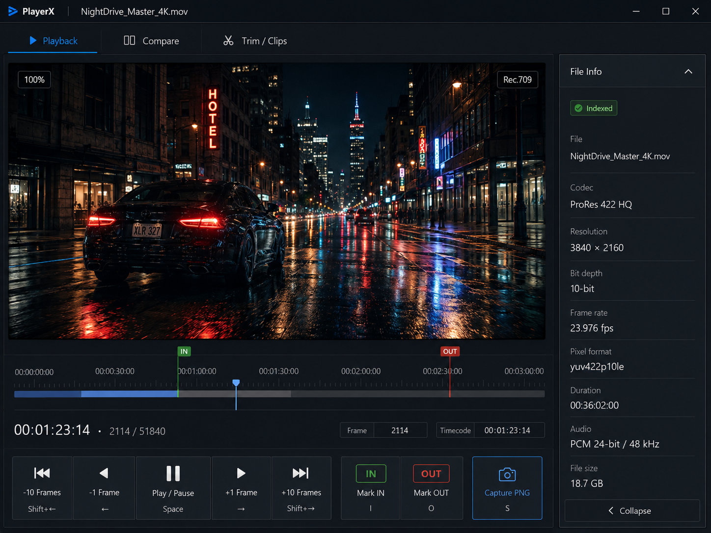

# 앱 개발 계획서: PlayerX — 프레임 정밀 영상 검수 플레이어

> 생성일: 2026-09-05
> 프레임 단위로 정확히 멈추고, 두 영상을 나란히 비교하고, 그 프레임을 손실 없이 PNG로 뽑아내는 Windows 데스크톱 플레이어.

---

## 1. 아이디어 개요

일반 플레이어(VLC, 곰플레이어 등)는 "대충 그 근처"로 이동한다. 화질 검수·인코딩 비교·모션 분석처럼 **정확히 1234번째 프레임**을 봐야 하는 작업에는 쓸 수 없다.

PlayerX는 혼자 쓰는 검수 도구다. mkv·mp4·mov·h264 같은 흔한 파일을 열어 프레임 단위로 앞뒤로 이동하고, 두 파일을 같은 프레임에 고정해 나란히 비교하고, 현재 프레임을 원본 해상도 그대로 PNG로 저장한다. 여기에 무손실 트림(재인코딩 없이 자르기)과 구간 마킹·이동을 얹는다.

혼자 쓰는 도구라서 **로그인·서버·다국어·업데이트 서버가 전부 필요 없다.** 그만큼 정확도와 속도에만 집중할 수 있다.

### 구현 난이도

🟠 **고급** — 재생 자체는 라이브러리가 해주지만, "정확한 프레임"을 보장하려면 컨테이너별 PTS(표시 시각)·timebase·키프레임 구조를 직접 다뤄야 하고, Windows에서 네이티브 DLL(libmpv/FFmpeg)을 함께 배포하는 작업이 따라붙는다.

## 2. 조사 키워드

- 주요 키워드: `frame accurate video player`, `libmpv frame-step`, `lossless PNG frame capture`, `side by side video comparison`, `lossless trim ffmpeg`, `frame accurate seeking PTS`
- 수집 소스: GitHub (6), Hugging Face (0), 논문 (0 — 이 주제는 논문보다 라이브러리 구현 문서가 근거), 커뮤니티 (3)

> AI 모델이 필요한 제품이 아니라서 Hugging Face 쪽은 조사 대상에서 실질적으로 제외했다.

## 3. 참고 오픈소스

> 이 프로젝트가 실제로 갖다 쓸 것, 그리고 코드를 읽어볼 것.

### [mpv / libmpv](https://github.com/mpv-player/mpv)
재생 엔진 그 자체. `libmpv`라는 C 라이브러리 형태로 내 앱 창 안에 끼워 넣을 수 있게 설계돼 있다. 하드웨어 디코딩, mkv/mp4/mov/h264 전 포맷, `frame-step`/`frame-back-step` 명령, `screenshot video`(화면 크기 무시하고 원본 해상도로 캡쳐), `screenshot-format=png`·`screenshot-high-bit-depth=yes`(10bit 소스를 10bit 그대로 저장)까지 이미 다 들어 있다.
- ⭐ 30k+ · C · GPLv2+ (기본) / LGPLv2.1+ 빌드 옵션 존재

### [jaseg/python-mpv](https://github.com/jaseg/python-mpv)
libmpv를 파이썬에서 그대로 조종하는 얇은 래퍼. Qt 위젯의 `winId()`를 `wid` 인자로 넘기면 그 위젯 안에서 영상이 재생된다. README가 **"Windows는 DLL 탐색 순서가 지저분하니 libmpv를 `%PATH%`나 `mpv.py` 옆에 두라"**고 명시하고 있다 — 이건 계획에 미리 반영했다.
- ⭐ 631 · Python · libmpv를 따라 GPLv2+ 또는 LGPLv2.1+

### [PyAV](https://github.com/PyAV-Org/PyAV)
FFmpeg의 디코딩 계층을 파이썬에서 직접 쓰는 바인딩. 패킷·프레임·PTS 단위로 접근할 수 있어서 **"이 시각의 정확히 그 프레임"**을 꺼내는 용도로 쓴다. 라이선스가 BSD-3라 제약이 가장 느슨하다.
- ⭐ 3.2k · Python/Cython · BSD 3-Clause

### [pixop/video-compare](https://github.com/pixop/video-compare)
정확히 우리가 만들려는 "비교" 기능의 완성형 레퍼런스. 좌우 분할·상하 분할·차분(subtraction) 모드, 프레임 단위 이동, 시간축 어긋난 영상 맞추기(time-shift), 히스토그램/벡터스코프/파형까지 있다. 코드가 GPLv2라 **복붙은 안 되고, 설계를 읽는 용도**로 쓴다.
- ⭐ 1.8k · C++14 (FFmpeg + SDL2) · GPL-2.0

### [mifi/LosslessCut](https://github.com/mifi/lossless-cut)
무손실 트림의 사실상 표준. 재인코딩 없이 컨테이너만 다시 묶어(remux) 잘라내는 방식, 구간 마킹 UI, 프레임 추출 기능이 어떻게 생겨야 하는지 참고한다. 역시 GPL-2.0이라 코드 참조용.
- ⭐ 43.5k · TypeScript (Electron) · GPL-2.0

### [FFMS/ffms2](https://github.com/FFMS/ffms2)
"프레임 단위 정확 접근"을 목표로 파일 전체를 미리 인덱싱하는 라이브러리. 인코딩 커뮤니티가 비교 스크린샷을 뽑을 때 쓰는 물건이다. 소스는 MIT지만 **공식 Windows 바이너리는 GPLv3**. 우리 방식(PyAV 자체 인덱싱)이 막히면 갈아탈 대안으로 남겨둔다.
- ⭐ 659 · C++ · MIT (소스) / 공식 Windows 빌드는 GPLv3

## 4. 참고 AI 모델

_해당하는 내용을 찾지 못했습니다._ — 이 제품은 AI 모델이 필요 없다. 정확도는 학습이 아니라 컨테이너 파싱의 정확도에서 나온다. (나중에 장면 전환 자동 검출 같은 걸 붙이면 그때 재조사)

## 5. 관련 논문/기술

> 논문보다 "구현 문서에 적힌 한계"가 이 제품의 핵심 근거라서 그쪽을 인용한다.

- **[mpv 매뉴얼 — frame-step / frame-back-step](https://mpv.io/manual/stable/)** — 뒤로 한 프레임 가는 동작은 내부적으로 **매번 정밀 탐색(seek)을 다시 수행**한다고 명시돼 있다. 그래서 느리고, 코너 케이스에서 어긋날 수 있다. 뒤로 이동을 제대로 쓰려면 `--demuxer-seekable-cache`(또는 `--cache`)로 되감기 캐시를 켜야 한다.
- **[mpv issue #7208 — 고프레임레이트에서 frame step back이 프레임을 건너뜀](https://github.com/mpv-player/mpv/issues/7208)** — 1~1000fps 테스트 파일로 재현된 실제 버그 리포트. 현재는 Closed 상태지만, **"프레임 뒤로 이동은 무조건 신뢰할 대상이 아니다"**는 교훈이 남는다. → 우리 설계에서 뒤로 이동은 mpv에 맡기지 않고 프레임 인덱스를 직접 계산해 절대 시각으로 seek한다.
- **[FFMS2 문서](https://github.com/ffms/ffms2/blob/master/doc/ffms2-vapoursynth.md)** — 프레임 정확 접근이 "usually(대개)" 보장된다고 표현한다. 즉 인덱싱 기반조차 100%는 아니며, 검증(캡쳐한 프레임 번호를 화면에 같이 표기)이 필요하다.
- **[thewiki.moe — Comparison 가이드](https://thewiki.moe/tutorials/comparison/)** — 인코딩 커뮤니티가 화질 비교 스크린샷을 뽑는 표준 절차. 비교 모드 UX 설계의 기준선.

## 6. 핵심 기능

> MVP는 1~4번. 5~8번은 그 뒤.

**1. 프레임 단위 이동** _(MVP)_
←/→ 한 번에 정확히 한 프레임. 화면에 항상 `프레임 번호 / 전체 프레임`과 타임코드를 같이 띄운다 — 이게 있어야 정확한지 눈으로 검증된다.

**2. 대표 포맷 재생** _(MVP)_
mkv, mp4, mov, h264/hevc, ProRes 등. libmpv가 FFmpeg 전체 디코더를 물고 있어서 별도 작업이 거의 없다.

**3. 무손실 PNG 캡쳐** _(MVP)_
현재 프레임을 **원본 해상도·원본 비트뎁스** 그대로 PNG 저장. 창 크기·확대 배율·자막·OSD의 영향을 받지 않는다. 10bit 소스는 16bit PNG로.

**4. 두 영상 비교** _(MVP)_
좌우 분할 / 슬라이더 와이프 / 차분(diff) 3가지 모드. 정지 상태에서 **같은 프레임 번호로 잠금**되는 게 기본 동작.

**5. 무손실 트림**
IN/OUT 구간을 잡아 재인코딩 없이 잘라내기. 화질이 그대로고 몇 초면 끝나지만, 키프레임 경계로 살짝 밀린다(아래 리스크 참조).

**6. 클립 마킹과 이동**
여러 구간을 마킹해 목록으로 관리하고, 단축키로 클립 사이를 건너뛴다. 목록 저장/불러오기(JSON).

**7. 디코딩 제어와 파일 정보**
하드웨어 디코딩(d3d11va/nvdec) on/off, 코덱·비트뎁스·색공간·프레임레이트·키프레임 간격 표시. 검수할 때 "왜 이렇게 보이는지"를 판단하는 근거가 된다.

**8. PNG 시퀀스 내보내기**
구간을 통째로 프레임 시퀀스로 뽑기.

## 7. 기술 스택

| 영역 | 기술 | 이유 |
|---|---|---|
| 언어 | Python 3.12 | 혼자 쓰는 도구라 개발 속도가 최우선. 무거운 연산은 전부 C 라이브러리가 한다 |
| UI | PySide6 (Qt 6) | 네이티브 창 핸들(`winId`)을 넘길 수 있어 libmpv를 창 안에 직접 박을 수 있다. Electron으로는 이게 깔끔하지 않다 |
| 재생 엔진 | libmpv (+ python-mpv) | 하드웨어 디코딩·전 포맷·프레임 스텝·원본 해상도 캡쳐가 이미 구현돼 있다 |
| 정밀 프레임 접근 | PyAV | PTS 단위로 직접 디코딩해 "정확히 그 프레임"을 보장. BSD 라이선스라 제약도 없다 |
| 트림/내보내기 | ffmpeg.exe (동봉 실행) | 스트림 복사(`-c copy`) 무손실 컷은 CLI가 가장 안정적이고 검증하기 쉽다 |
| 이미지 저장 | Pillow + NumPy | 16bit PNG 저장과 차분(diff) 계산 |
| 설정 저장 | JSON 파일 | 사용자 1명, DB가 필요 없다 |
| 배포 | PyInstaller (onedir) | libmpv-2.dll·ffmpeg.exe를 같이 묶어 폴더째 실행. 단일 exe(onefile)는 DLL 로딩이 꼬여서 피한다 |

> **핵심 설계: 이중 경로(dual path)**
> 재생은 libmpv가 하고, 캡쳐와 비교는 PyAV가 원본 파일에서 직접 프레임을 다시 디코딩한다. 화면에 그려진 픽셀을 긁는 게 아니라 **원본을 다시 읽기 때문에** 무손실이 보장된다.

## 8. 화면 구성

> 창 하나에 탭 3개. 혼자 쓰는 도구라 설정 화면도 최소로.

**① 재생 탭** — 영상 영역이 대부분을 차지하고, 아래에 타임라인 + 프레임 카운터(`00:01:23:14 · 2114 / 51840`), 하단에 재생/스텝/캡쳐 버튼. 오른쪽에 접히는 파일 정보 패널(코덱·해상도·비트뎁스·fps).

**② 비교 탭** — 위쪽에 A/B 파일 선택 줄, 가운데 비교 뷰(모드 전환: 좌우 / 와이프 / 차분), 아래 공용 타임라인 하나. **프레임 오프셋 입력칸**이 있어서 시작점이 다른 두 영상도 맞출 수 있다.

**③ 트림/클립 탭** — 왼쪽 클립 목록(IN/OUT/길이), 오른쪽 미리보기. 하단에 "무손실로 내보내기 / 정확히 자르기(재인코딩)" 두 버튼을 나란히 두고, 각각 무슨 차이인지 한 줄로 적어둔다.

**단축키** (전문 도구 관례를 따름) — `←`/`→` 1프레임, `Shift+←/→` 10프레임, `I`/`O` IN/OUT 마킹, `S` 캡쳐, `Space` 재생/정지, `[`/`]` 이전/다음 클립.

## 9. 개발 단계

| 단계 | 기간 | 작업 |
|---|---|---|
| 1단계 — 재생과 프레임 이동 | 1~2주 | PySide6 창 + libmpv 임베드, 파일 열기, 재생/정지, ←/→ 프레임 스텝, **프레임 번호·타임코드 표시**. 이 단계 끝에 실제로 켜서 쓸 수 있는 플레이어가 나온다 |
| 2단계 — 프레임 정확도와 캡쳐 | 2주 | PyAV로 프레임 인덱스(PTS 표) 생성, 뒤로 이동을 인덱스 기반 절대 seek으로 교체, 무손실 PNG 캡쳐(원본 해상도·16bit 옵션) |
| 3단계 — 비교 모드 | 2주 | mpv 인스턴스 2개 임베드, 프레임 잠금 동기화, 좌우/와이프/차분 렌더링, 프레임 오프셋 보정 |
| 4단계 — 트림과 클립 | 2주 | IN/OUT 마킹, 클립 목록, ffmpeg `-c copy` 무손실 컷, 정밀 컷(재인코딩) 옵션, 클립 간 이동 단축키 |
| 5단계 — 마감과 배포 | 1주 | 디코딩 설정 UI, PNG 시퀀스 내보내기, PyInstaller 패키징(DLL 동봉), 설정 저장 |
| 6단계 — 다듬기와 보강 | 계속 | 화면 목업을 실제 UI 로 반영, 쓰면서 드러난 느림·떨림·못 찾겠는 버튼 고치기, 작은 기능 덧붙이기. **항목을 미리 정하지 않는다** — 아래 설명 참고 |

**총 8~9주** (주당 10~15시간 기준). 1단계만 끝나도 매일 쓸 수 있는 물건이 되는 게 이 순서의 핵심이다.

### 6단계는 앞의 다섯과 성격이 다르다

1~5단계는 **만들기 전에 정할 수 있는 일**이다. 6단계는 아니다. 여기 들어오는 일은
전부 **다 만든 물건을 실제로 써 본 뒤에야 생긴다** —

- 계획서에 그림으로만 붙어 있던 화면 목업이 코드로 옮겨지지 않은 채 5단계까지 왔다는 것
- 타임라인을 끌면 한참 뒤에 따라온다는 것, 비교 탭 첫 열기에 2초가 걸린다는 것
- 영상을 어떻게 여는지 못 찾겠다는 것, 재생 중에 글자가 1px 씩 떨린다는 것

이런 건 계획을 아무리 잘 세워도 미리 적을 수 없다. 그래서 6단계는 **닫히지 않는다.**

**대신 규칙을 둔다.**

1. 고친 것·못 고친 것을 그때그때 `docs/PROGRESS.json` 의 6단계에 항목으로 적는다.
   못 고친 것도 `done: false` 로 **남겨 둔다** — 지운 채로 넘어가면 없던 일이 된다.
2. 수치로 말할 수 있는 것은 수치로 적는다 (예: `타임라인 그리기 10.2ms → 0.27ms`).
   느낌으로 적으면 다음에 또 느려졌을 때 비교할 기준이 없다.
3. 경위와 실패한 시도는 `docs/BUILD-LOG.md` 에 적는다. **실패한 시도를 적는 게 특히
   중요하다** — 안 되는 길을 다음 사람이 또 걷지 않게 하는 유일한 방법이다.
4. 새 기능이 붙어서 이 문서의 6절(핵심 기능)·8절(화면 구성)이 틀리게 되면 그쪽도
   같이 고친다. 계획서가 현재 물건과 어긋나기 시작하면 계획서로서 쓸모가 없어진다.

## 10. 리스크와 라이선스

| 리스크 | 대응 방안 |
|---|---|
| mpv의 `frame-back-step`이 고프레임레이트에서 프레임을 건너뛴다 ([issue #7208](https://github.com/mpv-player/mpv/issues/7208)) | 뒤로 이동을 mpv에 맡기지 않는다. 2단계에서 PyAV로 만든 PTS 인덱스를 써서 목표 프레임의 절대 시각으로 직접 seek. 화면의 프레임 카운터로 매번 검증 |
| 뒤로 이동이 느림 (매번 정밀 seek 수행) | `--demuxer-seekable-cache=yes` + 넉넉한 `--cache-secs`로 되감기 캐시 확보. 그래도 느린 코덱은 2단계 인덱스로 우회 |
| 큰 파일(4K, 장시간) 인덱싱에 시간이 오래 걸림 | 인덱싱을 백그라운드 스레드로 돌리고 진행률 표시. 결과를 `파일명.idx.json`으로 캐시해 두 번째부터는 즉시 로드 |
| 비교 재생 중 두 영상이 조금씩 어긋남(clock drift) | 비교 모드의 기본값을 **정지 + 프레임 잠금**으로 둔다. 연속 재생 시에는 A를 마스터로 삼아 주기적으로 B의 위치를 강제 보정 |
| 무손실 트림이 키프레임 경계로 밀려 원하는 지점에서 안 잘림 | UI에 가장 가까운 키프레임 위치를 미리 표시하고, "무손실(빠름·경계로 밀림)"과 "정확(재인코딩)" 두 버튼을 명시적으로 분리 |
| Windows에서 libmpv DLL을 못 찾아 실행이 안 됨 (python-mpv README가 직접 경고하는 지점) | 개발 초기부터 `libmpv-2.dll`을 프로젝트 폴더에 고정하고 `os.add_dll_directory()`로 명시 지정. PyInstaller는 onedir 모드로 폴더째 배포 |
| 캡쳐한 PNG가 "무손실"이 아닐 수 있음 (YUV→RGB 변환, 화면 스케일링 개입) | 화면 픽셀을 긁지 않고 PyAV로 원본을 다시 디코딩. 색 변환은 range/matrix를 명시 고정하고, 10bit 소스는 16bit PNG로 저장 |
| 기능을 벌리다 1단계가 안 끝남 | 1단계 범위를 "열기·재생·프레임 이동·프레임 번호 표시"로 고정. 여기에 캡쳐조차 넣지 않는다 |

### 라이선스 주의사항

혼자 쓰는 도구라면 아래 전부 **문제없이 그대로 쓸 수 있다.** 나중에 남에게 배포하거나 판매할 생각이 생기면 그때 다시 봐야 한다.

| 대상 | 라이선스 | 배포 시 의미 |
|---|---|---|
| libmpv | GPLv2+ (기본) / LGPLv2.1+ 빌드 가능 | 기본 빌드를 동봉해 배포하면 내 코드도 GPL이 된다. 소스 비공개로 배포하려면 **LGPL 빌드**의 libmpv를 써야 한다 |
| FFmpeg / ffmpeg.exe | LGPLv2.1+ (코어) / `--enable-gpl` 빌드는 GPL | 디코딩·remux만 쓰면 LGPL 빌드로 충분. x264 등이 들어간 GPL 빌드를 동봉하면 GPL 전파 |
| PyAV | BSD 3-Clause | 제약 없음 |
| PySide6 (Qt) | LGPLv3 / 상용 | 동적 링크로 쓰면 상용 배포도 가능. 파이썬은 원래 동적 링크라 자연히 충족 |
| pixop/video-compare | GPL-2.0 | **코드 복사 금지.** 설계 참고만 |
| LosslessCut | GPL-2.0 | **코드 복사 금지.** 동작 방식 참고만 |
| ffms2 | MIT(소스) / 공식 Win 바이너리 GPLv3 | 쓰게 된다면 직접 LGPL FFmpeg로 빌드해야 안전 |
| OpenRV | Apache-2.0 | 가장 느슨. 참고·차용 모두 자유 |

## 11. 커뮤니티 반응

> 실제로 만든 사람들이 어디서 막혔는지.

**"프레임 뒤로 가기는 원래 어렵다"** — mpv 매뉴얼 자체가 frame-back-step에 대해 "정밀하려고 애쓰기 때문에 느리고, 기대와 다르게 동작하기도 한다"고 적어놨다. [issue #7208](https://github.com/mpv-player/mpv/issues/7208)에서는 fps가 높을수록 더 많이 건너뛰는 현상이 1~1000fps 테스트 파일로 재현됐다. **이 프로젝트가 존재할 이유이자 가장 큰 기술 리스크다.**

**"여러 인스턴스 동기화는 결국 시계 드리프트 문제"** — mpv 진영의 [mpvsync](https://github.com/esterkimx/mpvsync), [groupwatch_sync](https://github.com/po5/groupwatch_sync), [Syncplay](https://github.com/Syncplay/syncplay) 모두 **재생 속도를 미세 조정하거나 주기적으로 위치를 강제 보정**하는 방식으로 해결한다. 우리도 같은 길을 간다.

**"화질 비교는 정지 프레임으로 한다"** — 인코딩 커뮤니티의 [비교 가이드](https://thewiki.moe/tutorials/comparison/)와 [FrameForge](https://jessielw.com/gitea/jlw_4049/FrameForge) 같은 도구가 전부 "같은 프레임 번호로 뽑은 정지 이미지"를 표준으로 삼는다. 비교 모드의 기본값을 정지로 두는 근거.

**"Windows + 네이티브 DLL이 진짜 시간 잡아먹는 구간"** — python-mpv README가 직접 "Windows는 공유 라이브러리 처리가 꽤 나쁘니 고생을 각오하라"고 써놨다. 그래서 이 작업을 1단계에 넣었다 — 마지막에 만나면 훨씬 아프다.

## 12. 유사 서비스

| 제품 | 성격 | PlayerX와의 차이 |
|---|---|---|
| [Open RV](https://github.com/AcademySoftwareFoundation/OpenRV) (Apache-2.0) | 아카데미 기술상 받은 VFX 리뷰 플레이어. 프레임 정확·비교·주석 전부 있음 | 압도적으로 강력하지만 EXR/시퀀스 중심의 스튜디오 파이프라인 도구라, 빌드가 무겁고 mkv/mp4 일상 검수에는 과하다 |
| [DJV](https://github.com/darbyjohnston/DJV) | 오픈소스 VFX 리뷰 툴. 3.0에서 타임라인·USD 지원 부활 | 마찬가지로 영화 파이프라인 지향 |
| [pixop/video-compare](https://github.com/pixop/video-compare) (GPL-2.0) | 비교 기능만 놓고 보면 완성형 | CLI 실행에 SDL 창 하나. 트림·클립 관리·PNG 워크플로가 없다 |
| [LosslessCut](https://github.com/mifi/lossless-cut) (GPL-2.0) | 무손실 컷의 표준 | 자르기 전용. 프레임 단위 검수와 비교가 목적이 아니다 |
| PotPlayer / MPC-HC | 프레임 스텝을 지원하는 무료 플레이어 | 정확도 보장이 없고 두 영상 비교가 안 된다 |
| Telestream Switch | 상용 검수 플레이어 (파형·벡터스코프 포함) | 유료. 그리고 내 워크플로에 맞출 수 없다 |

**PlayerX가 다른 점 한 줄** — 프레임 정확 이동 · 두 영상 비교 · 무손실 PNG 캡쳐 · 무손실 트림, 이 네 가지가 **하나의 창 안에서 같은 프레임 번호로 이어지는** 도구는 없다. 지금은 프로그램 세 개를 오가며 해야 하는 일이다.

---

## 부록 — 확정한 가정

원래 물어봐야 하지만 답이 뻔해서 정하고 넘어간 것들. 다르면 말해달라.

- **대상 OS는 Windows 11 하나.** 크로스 플랫폼은 고려하지 않는다 (PySide6/libmpv라 나중에 옮기는 건 가능).
- **"클립이동"은 마킹한 구간 사이를 단축키로 건너뛰는 것**으로 해석했다. 타임라인에서 클립 순서를 재배열하는 편집(NLE)이 아니다.
- **"디코딩 기능"은 하드웨어/소프트웨어 디코더 선택 + 코덱 정보 표시 + PNG 시퀀스 내보내기**로 해석했다.
- **음성·자막은 재생만 지원**하고 편집 기능은 넣지 않는다.
- **최대 대상 해상도는 4K.** 8K는 인덱싱·비교 성능을 별도로 검증해야 한다.

## 화면 목업

> 2026년 9월 5일 오후 07:12 · Codex(ChatGPT) 생성 · 다시 만들려면 BUILD STUDIO 에서 [화면 목업]
